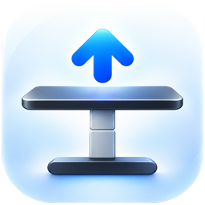

<p align="center"></p>

# Standup — Desk Remote Control

A native macOS menu bar app for your Bluetooth sit/stand desk (IKEA IDÅSEN with the Linak controller). It shows the current height and moves the desk with one click.


Made by [Michal Sagan](https://sagan.dev) · [sagan.dev](https://sagan.dev). See the [changelog](CHANGELOG.md) for what is new.

## Features

* Lives in the menu bar; the popover shows the current height and the connection status
* **Raise / lower**: hold the round buttons and the desk keeps moving, release to stop
* **Stand / Sit presets**: one click sends the desk to the saved height (click again to stop)
* Preferences for the standing and sitting heights, units (cm or inches) and a height calibration
* Reconnects to the desk automatically after sleep or a dropped connection
* Launch at login
* AppleScript support (for Shortcuts, Alfred and similar)

## Requirements

* macOS 12 or newer
* A Linak-based Bluetooth desk whose name contains "Desk" (for example the IKEA IDÅSEN)

## Build & run

There is no prebuilt release yet, so build it with Xcode:

```sh
git clone https://github.com/sagan-dev/Standup.git
cd Standup
open Standup.xcodeproj
```

Pick your own signing team under *Signing & Capabilities*, then press Run. Swift Package Manager fetches the only dependency ([LaunchAtLogin](https://github.com/sindresorhus/LaunchAtLogin)) automatically.

Standup asks for Bluetooth access, which it needs to talk to the desk.

To open Preferences, choose **…** → *Preferences…* in the popover, or right-click the menu bar icon.

## Logo

The app icon is in `Standup/Assets.xcassets/AppIcon.appiconset` (16, 32, 64, 128, 256, 512 and 1024 px); the 1024 px source is `design/AppIcon-source-1024.png`. The menu bar icon is a template symbol set in `Standup/StatusItemController.swift` (`configureButton()`).

## Troubleshooting

* Close any other app that is connected to the desk (a phone app, another Mac). The desk talks to one device at a time.
* The desk is found by name, so its Bluetooth name must still contain "Desk" — check this if you renamed it in the manufacturer's app.
* If it is still not found, reset the desk: lower it to the bottom, hold the physical "down" button for a second or two until it moves slightly, then hold the Bluetooth button on the controller until the blue light blinks.

## AppleScript

Standup has a small scripting dictionary:

```applescript
tell application "Standup" to move desk "stand"      -- "sit", "stand", "up" or "down"
tell application "Standup" to set desk height "120cm" -- "120cm", "48in", or "80" in your preferred unit
```

`up` and `down` move the desk by about a centimetre; `sit` and `stand` go to the heights saved in Preferences.

## Third-party software

* [LaunchAtLogin](https://github.com/sindresorhus/LaunchAtLogin) by Sindre Sorhus — MIT license (start at login).

## Acknowledgements

Standup was inspired by [idasen-desk-controller-mac](https://github.com/DWilliames/idasen-desk-controller-mac) by David Williames (MIT). This project shares no code with it; thanks for showing what a native menu bar desk controller can be. The Bluetooth service identifiers come from the publicly documented Linak desk protocol.

Standup is made by [Michal Sagan](https://sagan.dev) — [sagan.dev](https://sagan.dev).

## License

[MIT](LICENSE.md)
